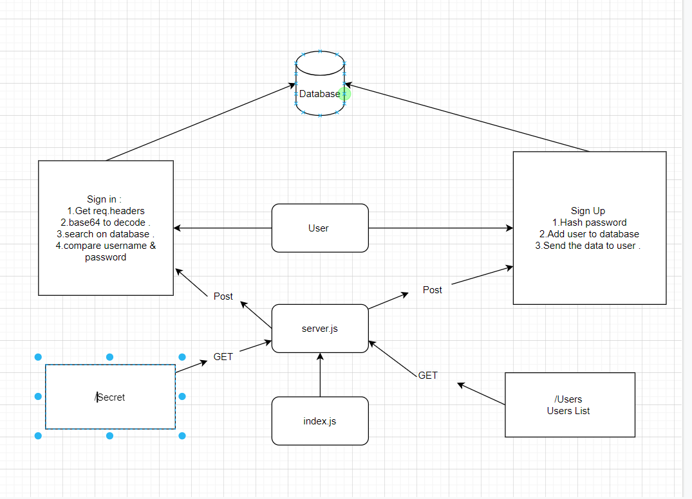

# bearer-auth

# [heroku](https://zaid-bearer-auth.herokuapp.com/)
# [PR](https://github.com/zaidalasfar97/bearer-auth/pull/1)
# [Action](https://github.com/zaidalasfar97/bearer-auth/actions)

# how to work with this repo:
#### 1-npm init -y
#### npm i express dotenv cors morgan mongoose bcrypt base-64
#### npm i -D jest @code-fellows/supergoos

